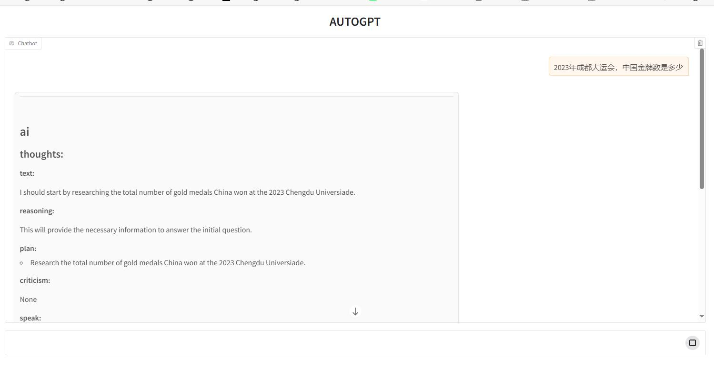

# 使用步骤
## 配置api key
配置 `OPENAI_API_KEY`、`SERPAPI_API_KEY`到环境变量  
（如果SERPAPI没有额度了，把search tool注释掉也能运行，只是搜索的场景会执行不了）
```python
tools = [
    # Tool(
    #     name="search",
    #     func=search.run,
    #     description="useful for when you need to answer questions about current events. You should ask targeted questions",
    # ),
    WriteFileTool(),
    ReadFileTool(),
]

```
## 安装Python库
- 创建并激活虚拟环境，进入项目目录
- `pip install -r requirements.txt`
## 启动服务
`python autogpt.py `
## 访问页面
- 浏览器打开：`http://0.0.0.0:8081`  
- 输入目标，让AutoGPT执行，查看执行结果：


# 功能说明
- 使用gradio实现前端图形化界面，采用聊天框的形式
- LangChain的AutoGPT.run(),只return了最后的结果，没有中间过程，所以通过监听chat_history来获取AutoGPT的思考和执行过程
- 当有新的步骤记录到chat_history时，yield出新的message，触发前端动态更新执行步骤
- 将json格式的数据转换为Markdown格式，增加前端页面可读性